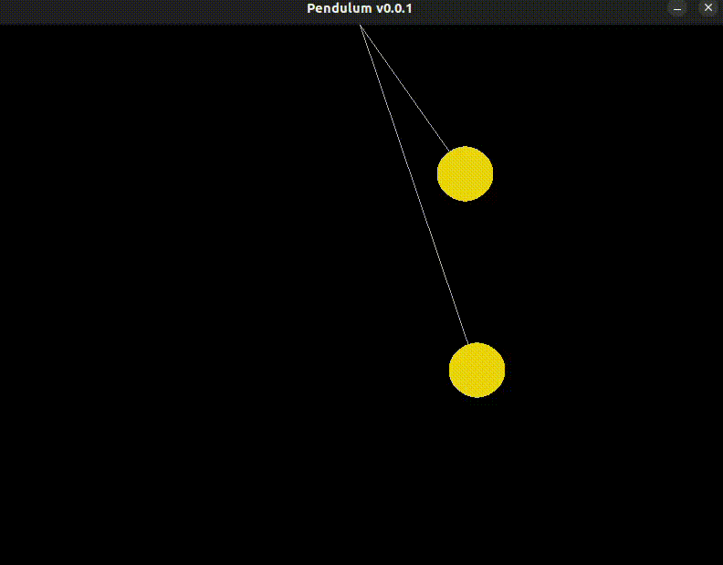

# Simulação de Pêndulo com SDL2

Este projeto é uma simulação gráfica de pêndulos usando a biblioteca **SDL2** com **SDL2_gfx**, escrita em C++. A animação representa o movimento de dois pêndulos simples utilizando física básica e renderização 2D.

## 📷 Preview



## 📽️ Inspiração

Este código é uma adaptação do projeto em *javascript* apresentado no vídeo do canal *Manual do Código*:

🔗 [Programei um PÊNDULO depois de jogar CHRONO TRIGGER - YouTube](https://www.youtube.com/watch?v=QF17RZjlsXM&t=133s&ab_channel=ManualdoC%C3%B3digo)

🔗 [Projeto original em JavaScript](https://editor.p5js.org/ManualDoCodigo/sketches/APIZlMLuC)

## 🛠️ Requisitos

Para compilar e executar este projeto, você precisa ter instalados:

- **SDL2**
- **SDL2_gfx**
- **g++** ou outro compilador C++ compatível

## 💻 Compilação e Execução

### No Linux:

```bash
g++ pendulo.cpp -o pendulo -lSDL2 -lSDL2_gfx
./pendulo
````

### No Windows (MinGW, por exemplo):

Certifique-se de que as bibliotecas SDL2 e SDL2\_gfx estão corretamente instaladas e linkadas.

```bash
g++ pendulo.cpp -o pendulo.exe -lmingw32 -lSDL2main -lSDL2 -lSDL2_gfx
pendulo.exe
```

## 🧪 Funcionalidades

* Simulação de dois pêndulos com diferentes comprimentos.
* Física básica aplicada: aceleração angular, velocidade angular e atrito.


## 📁 Estrutura

* `pendulo.cpp`: código-fonte principal.
* `README.md`: este arquivo de documentação.

## 📄 Licença

Este projeto é fornecido para fins educacionais. Sinta-se livre para modificar e reutilizar conforme desejar, dando os devidos créditos ao autor original da ideia.

---

Desenvolvido com base no conteúdo do canal [Manual do Código](https://www.youtube.com/@ManualdoCodigo).
